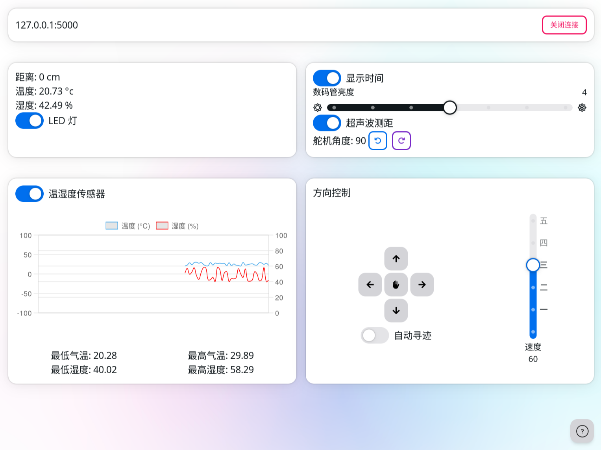

# 智能循迹测温小车



## 项目简介

基于树莓派的智能循迹测温小车，能够通过多种传感器和控制模块实现自动寻迹和环境感知。
项目分为控制端和树莓派端，控制端负责发送指令，树莓派端负责执行和反馈。

## 技术栈

硬件: 树莓派 3B 、RGB 三色灯、电机、蜂鸣器、数码管、舵机、温湿传感器、超声波测距。

操作系统：Linux

技术栈:

- 控制端
  - TypeScript
  - Tauri
  - React
  - NextUI
  - Tailwind CSS
- 树莓派端:
  - Rust
  - Opencv

## 功能实现

- 实现了 RGB 三色灯的控制，能够根据环境变化显示不同颜色。
- 控制电机实现小车的前进、后退、转向等基本运动。
- 编写蜂鸣器控制代码，实现警报和提示音功能。
- 实现数码管显示功能，用于显示小车状态信息。
- 控制舵机实现小车的精确转向。
- 集成温湿传感器，实时监测环境温湿度。
- 实现超声波测距功能，用于避障和距离测量。

## 项目成果

成功实现了小车的自动循迹功能，能够在复杂环境中稳定运行。
提高了传感器数据处理的效率，增强了小车的环境感知能力。
项目展示中，小车能够准确避开障碍物，并根据环境变化做出相应调整。

## 安装

### 安装-树莓派端

要求：

- Opencv 4.6.0

树莓派端运行在 armv7 架构的设备上，而由于树莓派性能较差，因此需要使用 Docker 进行交叉编译。

```bash
# 使用 Docker 构建 armv7 版本的可执行文件
cross build --target=armv7-unknown-linux-gnueabihf --all-features --release --package=car-server
```

### 安装-控制器端

[查看 tauri 要求](https://v2.tauri.app/start/prerequisites/)

```bash
cd car-client && yarn run tauri build
```
